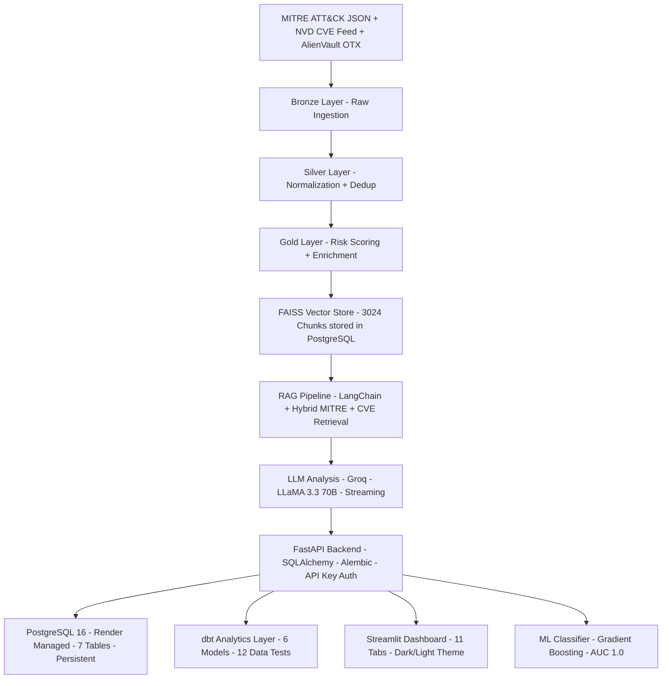

# CyberMind - AI-Powered Threat Intelligence Platform

[](https://cybermindai.streamlit.app)
[](https://cybermind-0y0t.onrender.com/docs)
[](https://github.com/durgasri-dotcom/cybermind/actions)
[](https://python.org)
[](LICENSE)
[](https://github.com/durgasri-dotcom/cybermind/actions)
[](https://cybermind-0y0t.onrender.com/docs)

CyberMind is a production-grade AI-powered threat intelligence platform built for security teams. It combines RAG with 3,024 MITRE ATT&CK vector embeddings stored in PostgreSQL, LLM-powered analysis via LLaMA 3.3 70B, live CVE ingestion from NVD, real-time IOC feeds from AlienVault OTX, AI-generated Sigma detection rules, kill chain timeline visualization, and an ML threat severity classifier all served through a FastAPI backend with a dbt analytics layer on PostgreSQL.

---

## Live Demo

| Service     | URL                                                                     |
| ----------- | ----------------------------------------------------------------------- |
| Dashboard   | [cybermindai.streamlit.app](https://cybermindai.streamlit.app)          |
| Backend API | [cybermind-0y0t.onrender.com](https://cybermind-0y0t.onrender.com/docs) |
| API Docs    | [/docs](https://cybermind-0y0t.onrender.com/docs)                       |

---

## Architecture



---

## Tech Stack

| Layer          | Technology                                                         |
| -------------- | ------------------------------------------------------------------ |
| LLM            | Groq API - LLaMA 3.3 70B Versatile - Streaming                     |
| RAG            | LangChain - FAISS - PostgreSQL Vector Store - Hybrid Retrieval     |
| ML             | Gradient Boosting Classifier - scikit-learn - AUC 1.0 - CV F1 0.97 |
| Backend        | FastAPI - Pydantic v2 - Uvicorn                                    |
| Database       | PostgreSQL 16 - SQLAlchemy ORM - Alembic Migrations                |
| Analytics      | dbt - 6 models - 12 data quality tests - analytics schema          |
| Embeddings     | fastembed - ONNX Runtime - all-MiniLM-L6-v2 - no PyTorch           |
| Auth           | X-API-Key middleware on all write endpoints                        |
| CVE Intel      | NVD REST API - CVSS scoring - MITRE ATT&CK mapping - 228 CVEs      |
| IOC Feed       | AlienVault OTX - live pulses - IP/hash/domain/CVE indicators       |
| Cybersecurity  | Sigma Rule Generation - Kill Chain Timeline - MITRE ATT&CK         |
| Observability  | Request logging middleware - API analytics endpoint                |
| Dashboard      | Streamlit - Plotly - 11-tab dark/light UI                          |
| Infrastructure | Docker - GitHub Actions CI/CD - Render (Backend + DB)              |
| Testing        | pytest - 90 tests                                                  |

---

## Features

**RAG-Powered Threat Intelligence Q&A**
Ask anything about MITRE ATT&CK techniques, threat actors, or CVEs in natural language. CyberMind retrieves the top-K semantically similar chunks from 3,024 FAISS vectors stored in PostgreSQL no ephemeral disk and generates a structured 6-section analyst report using LLaMA 3.3 70B with full MITRE source attribution and similarity scores.

**Streaming LLM Responses**
The `/api/v1/intel/stream` endpoint streams tokens in real time using Groq's streaming API, enabling progressive rendering of threat analysis reports in production UIs.

**AI-Generated Sigma Detection Rules**
Submit any threat query and CyberMind generates a complete, valid Sigma YAML rule deployable directly to Splunk, Microsoft Sentinel, or Elastic SIEM including title, detection logic, log source, false positives, and MITRE ATT&CK tags.

**Kill Chain Timeline Visualization**
Generate a phase-by-phase MITRE ATT&CK kill chain for any threat from Reconnaissance through Impact with technique IDs, tactic codes, severity levels, and descriptions rendered as an interactive timeline.

**Live IOC Feed from AlienVault OTX**
Ingest real-time threat pulses from AlienVault OTX with IP addresses, file hashes, domains, and CVEs automatically mapped to MITRE ATT&CK techniques. TLP classification, author attribution, and tag filtering included.

**ML Threat Severity Classifier**
Gradient Boosting classifier trained on 182 real NVD CVEs achieves AUC=1.0 and 5-fold CV F1=0.97. Predicts CRITICAL/HIGH/MEDIUM severity from CVSS score, risk score, and 10 NLP features extracted from vulnerability descriptions. Served via REST API with confidence scores and class probabilities.

**dbt Analytics Layer**
Six dbt models transform raw PostgreSQL data into analytics-ready tables in a dedicated analytics schema staging models for CVEs, alerts, and API logs; mart models for CVE summary, API performance, and threat coverage. 12 data quality tests validate uniqueness, nullability, and accepted values.

**Production PostgreSQL Backend with Alembic Migrations**
All alerts, playbooks, entities, CVEs, request logs, and vector embeddings are persisted to a managed PostgreSQL 16 database on Render. Schema versioned with Alembic fully reproducible with `alembic upgrade head`. Data survives every restart, redeploy, and crash.

**Live CVE Ingestion from NVD**
Fetch real CVEs from the NVD API by recency, severity, or keyword. Each CVE is automatically scored with CVSS, CWE weaknesses are extracted, and techniques are mapped to MITRE ATT&CK using heuristic CWE-to-TTP analysis.

**AI-Generated Incident Response Playbooks**
Submit any MITRE technique ID and CyberMind generates a structured incident response playbook with containment, eradication, and recovery steps including responsible teams, tools, and time estimates.

**AI-Assisted Alert Triage**
Create security alerts and trigger AI triage priority recommendation (P1-P4), reasoning, immediate actions, and escalation decision generated by LLaMA 3.3.

**API Observability and Analytics**
Every API request is automatically logged to PostgreSQL endpoint, method, status code, latency, client IP, timestamp. Query aggregated stats via `/api/v1/analytics/requests`.

**Entity Graph and Threat Actor Profiles**
Add threat actors, malware families, and tools. Visualize entity relationships on an interactive Plotly graph. Enrich any entity with an AI-generated threat profile.

**Medallion Data Pipeline**
Bronze to Silver to Gold architecture ingests raw MITRE ATT&CK JSON and NVD CVE feeds, normalizes and scores threats, and produces embedding-ready documents for the vector store.

---

## Project Structure

```
cybermind/
├── configs/                  # Pydantic BaseSettings, structured logging
├── src/
│   ├── backend/
│   │   ├── database/         # SQLAlchemy engine, ORM models, Alembic migrations
│   │   ├── middleware/       # API key auth, request logging
│   │   ├── models/           # Pydantic schemas
│   │   ├── routers/          # FastAPI routers (threats, intel, alerts, playbooks,
│   │   │                     #   entities, cves, analytics, ioc, classifier, health)
│   │   ├── services/         # RAG, LLM, embeddings, threat scoring, MITRE loader,
│   │   │                     #   CVE service, IOC service
│   │   └── main.py           # FastAPI app with lifespan, middleware, CORS
│   ├── pipeline/             # MITRE ingest, CVE ingest, transform, vector store build
│   └── dashboard/            # Streamlit 11-tab dashboard
├── dbt/                      # dbt analytics project
│   └── cybermind_dbt/
│       ├── models/
│       │   ├── staging/      # stg_cves, stg_alerts, stg_request_logs
│       │   └── marts/        # mart_cve_summary, mart_api_performance, mart_threat_coverage
│       └── dbt_project.yml
├── data/
│   ├── bronze/               # Raw MITRE ATT&CK JSON
│   ├── silver/               # Normalized threat records
│   └── gold/
│       └── models/           # Trained classifier, confusion matrix, feature importance
├── scripts/                  # seed_embeddings.py, train_threat_classifier.py
├── tests/                    # 90 tests
├── streamlit_app.py          # Standalone Streamlit Cloud entry point
└── .github/workflows/        # CI/CD + scheduled data pipeline
```

---

## Database Schema

| Table           | Description                                                    |
| --------------- | -------------------------------------------------------------- |
| alerts          | Security alerts with priority, status, MITRE technique linkage |
| playbooks       | AI-generated IR playbooks with step-by-step JSON               |
| entities        | Threat actors, malware, tools with relationship graph          |
| cves            | Live CVEs from NVD with CVSS scores and MITRE mappings         |
| request_logs    | Every API call logged with latency and status code             |
| embeddings      | 3,024 FAISS vector embeddings stored in PostgreSQL             |
| alembic_version | Schema migration version tracking                              |

---

## Quick Start

**1. Clone and install:**

```bash
git clone https://github.com/durgasri-dotcom/cybermind.git
cd cybermind
pip install -r requirements.txt
```

**2. Set up environment:**

```bash
cp .env.example .env
# Add GROQ_API_KEY, CYBERMIND_API_KEY, DATABASE_URL, OTX_API_KEY
```

**3. Run the data pipeline:**

```bash
python -m src.pipeline.ingest_mitre
python -m src.pipeline.transform_threats
python -m src.pipeline.build_vector_store
```

**4. Seed embeddings into PostgreSQL:**

```bash
python scripts/seed_embeddings.py
```

**5. Train the threat classifier:**

```bash
python scripts/train_threat_classifier.py
```

**6. Initialize the database:**

```bash
alembic upgrade head
```

**7. Run dbt analytics models:**

```bash
cd dbt/cybermind_dbt
dbt run
dbt test
```

**8. Start the backend:**

```bash
uvicorn src.backend.main:app --reload
```

**9. Start the dashboard:**

```bash
streamlit run streamlit_app.py
```

**Or run with Docker:**

```bash
docker-compose up --build
```

---

## API Reference

| Method | Endpoint                   | Auth | Description                                            |
| ------ | -------------------------- | ---- | ------------------------------------------------------ |
| POST   | /api/v1/intel/query        | -    | RAG-powered threat intelligence Q&A with MITRE sources |
| POST   | /api/v1/intel/stream       | -    | Streaming LLM threat analysis                          |
| POST   | /api/v1/intel/sigma        | -    | AI-generated Sigma detection rule                      |
| POST   | /api/v1/intel/killchain    | -    | MITRE ATT&CK kill chain timeline                       |
| GET    | /api/v1/ioc/pulses         | -    | Live AlienVault OTX threat pulses                      |
| GET    | /api/v1/ioc/search         | -    | Search OTX by indicator                                |
| GET    | /api/v1/classifier/predict | -    | Predict threat severity with confidence                |
| GET    | /api/v1/classifier/info    | -    | ML model metadata and performance metrics              |
| GET    | /api/v1/threats            | -    | List and filter MITRE threat records                   |
| POST   | /api/v1/alerts             | Yes  | Create security alert                                  |
| POST   | /api/v1/alerts/{id}/triage | -    | AI-assisted alert triage                               |
| POST   | /api/v1/playbooks/generate | Yes  | Generate AI incident response playbook                 |
| POST   | /api/v1/entities/enrich    | -    | LLM entity threat profile                              |
| POST   | /api/v1/cves/ingest/recent | Yes  | Ingest recent CVEs from NVD                            |
| GET    | /api/v1/cves/stats         | -    | CVE severity distribution and avg CVSS                 |
| GET    | /api/v1/analytics/requests | -    | API usage stats and latency analytics                  |
| GET    | /api/v1/health             | -    | Platform health and DB connectivity check              |

Auth (Yes) requires X-API-Key header. Full interactive docs at `/docs`.

---

## Tests

```bash
pytest tests/ -v
# 90 passed
```

Covers threat scoring, RAG retrieval, playbook parsing, MITRE data pipeline, SQLAlchemy ORM, CVE service, analytics queries, and embedding service.

---

## Deployment

**Streamlit Cloud (Dashboard):**
Deployed at [cybermindai.streamlit.app](https://cybermindai.streamlit.app).

**Render (Backend + PostgreSQL):**

- FastAPI backend at [cybermind-0y0t.onrender.com](https://cybermind-0y0t.onrender.com)
- PostgreSQL 16 managed database on Render (Oregon region)
- Monitored 24/7 via UptimeRobot

**Docker (Full Stack):**

```bash
docker-compose up --build
# Backend:   http://localhost:8000
# Dashboard: http://localhost:8501
```

---

## Data Sources

- [MITRE ATT&CK Enterprise](https://attack.mitre.org/) - 691 techniques and sub-techniques
- [NVD CVE Feed](https://nvd.nist.gov/developers/vulnerabilities) - live CVE ingestion via REST API
- [AlienVault OTX](https://otx.alienvault.com/) - real-time IOC threat pulses

---

Built by Sri Durga Abhigna Tanguturi
