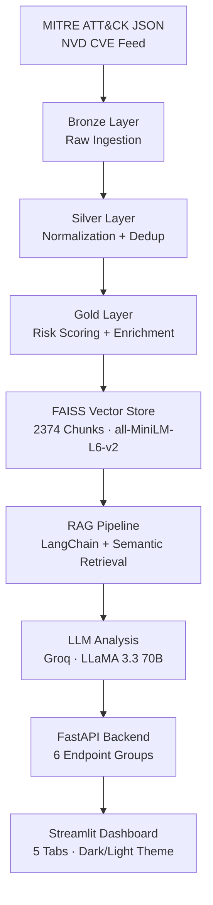

# ⬡ CyberMind — AI-Powered Threat Intelligence Platform

[](https://cybermindai.streamlit.app)
[](https://github.com/durgasri-dotcom/cybermind/actions)
[](https://python.org)
[](LICENSE)
[](https://github.com/durgasri-dotcom/cybermind/actions)

CyberMind is a production-grade AI threat intelligence platform that combines RAG (Retrieval-Augmented Generation), FAISS vector search, and LLM-powered analysis to help security teams understand, triage, and respond to cyber threats in real time.

Built on 691 real MITRE ATT&CK techniques indexed into a FAISS vector store, CyberMind answers natural language security queries, generates structured incident response playbooks, and visualizes threat actor relationships all powered by LLaMA 3.3 70B via Groq.

---

## Live Demo

**[cybermindai.streamlit.app](https://cybermindai.streamlit.app)**

---

## Architecture



---

## Tech Stack

| Layer          | Technology                                       |
| -------------- | ------------------------------------------------ |
| LLM            | Groq API · LLaMA 3.3 70B Versatile               |
| RAG            | LangChain · FAISS · HuggingFace all-MiniLM-L6-v2 |
| Backend        | FastAPI · Pydantic v2 · Uvicorn                  |
| Dashboard      | Streamlit · Plotly                               |
| Data           | MITRE ATT&CK (691 techniques) · NVD CVE          |
| Infrastructure | Docker · GitHub Actions CI/CD                    |
| Testing        | pytest · 45 tests                                |

---

## Features

**RAG-Powered Threat Intelligence Q&A**
Ask anything about MITRE ATT&CK techniques, threat actors, or CVEs in natural language. CyberMind embeds your query, retrieves the top-K semantically similar chunks from the FAISS index, and generates a structured analyst-grade response using LLaMA 3.3.

**AI-Generated Incident Response Playbooks**
Submit any MITRE technique ID and CyberMind generates a structured incident response playbook with containment, eradication, and recovery steps including responsible teams, tools, and time estimates.

**AI-Assisted Alert Triage**
Create security alerts and trigger AI triage priority recommendation (P1–P4), reasoning, immediate actions, and escalation decision generated by LLaMA 3.3.

**Entity Graph & Threat Actor Profiles**
Add threat actors, malware families, and tools. Visualize entity relationships on an interactive graph. Enrich any entity with an AI-generated threat profile covering TTPs, targeting patterns, and detection recommendations.

**Medallion Data Pipeline**
Bronze → Silver → Gold architecture ingests raw MITRE ATT&CK JSON and NVD CVE feeds, normalizes and scores threats, and produces embedding-ready documents for the vector store. Runs on a daily GitHub Actions schedule.

---

## Project Structure

```
cybermind/
├── configs/                  # Pydantic BaseSettings, structured logging
├── src/
│   ├── backend/
│   │   ├── models/           # Pydantic schemas (threat, alert, playbook, entity)
│   │   ├── routers/          # FastAPI routers (threats, intel, alerts, playbooks, entities, health)
│   │   ├── services/         # RAG, LLM, embeddings, threat scoring, MITRE loader
│   │   └── main.py           # FastAPI app with lifespan, middleware, CORS
│   ├── pipeline/             # MITRE ingest, CVE ingest, transform, vector store build
│   └── dashboard/            # Streamlit multi-tab dashboard
├── data/
│   ├── bronze/               # Raw MITRE ATT&CK JSON
│   ├── silver/               # Normalized threat records
│   └── gold/                 # Scored, embedded, FAISS index
├── tests/                    # 45 tests across pipeline, RAG, playbooks, scoring
├── streamlit_app.py          # Standalone Streamlit Cloud entry point
└── .github/workflows/        # CI/CD + scheduled data pipeline
```

---

## Quick Start

**1. Clone and install:**

```bash
git clone https://github.com/durgasri-dotcom/cybermind.git
cd cybermind
pip install -r requirements.txt
```

**2. Set up environment:**

```bash
cp .env.example .env
# Add your GROQ_API_KEY to .env
# Get a free key at console.groq.com
```

**3. Run the data pipeline:**

```bash
python -m src.pipeline.ingest_mitre
python -c "from src.backend.services.mitre_loader import load_raw, parse_techniques, save_normalized; save_normalized(parse_techniques(load_raw()))"
python -m src.pipeline.transform_threats
python -m src.pipeline.build_vector_store
```

**4. Start the backend:**

```bash
uvicorn src.backend.main:app --reload
```

**5. Start the dashboard:**

```bash
streamlit run src/dashboard/app.py
```

**Or run with Docker:**

```bash
docker-compose up --build
```

---

## API Reference

| Method | Endpoint                     | Description                                    |
| ------ | ---------------------------- | ---------------------------------------------- |
| POST   | `/api/v1/intel/query`        | RAG-powered threat intelligence Q&A            |
| POST   | `/api/v1/intel/similar`      | Semantic similarity search over threat vectors |
| GET    | `/api/v1/intel/status`       | Vector store status                            |
| GET    | `/api/v1/threats`            | List and filter threat records                 |
| POST   | `/api/v1/threats`            | Create threat record                           |
| POST   | `/api/v1/playbooks/generate` | Generate AI incident response playbook         |
| GET    | `/api/v1/playbooks`          | List saved playbooks                           |
| POST   | `/api/v1/alerts`             | Create security alert                          |
| POST   | `/api/v1/alerts/{id}/triage` | AI-assisted alert triage                       |
| POST   | `/api/v1/entities/enrich`    | LLM-generated entity threat profile            |
| GET    | `/api/v1/health`             | Platform health and service status             |

Full interactive docs at `/docs` when the backend is running.

---

## Data Pipeline

```
MITRE ATT&CK Enterprise JSON  ──►  Bronze (raw)
NVD CVE REST API              ──►  Bronze (raw)
                                        │
                                   Silver (normalized, deduped)
                                        │
                                   Gold (scored, enriched)
                                        │
                                   FAISS Index (2,374 vectors)
```

Runs automatically every day at 06:00 UTC via GitHub Actions. Can be triggered manually from the Actions tab.

---

## Tests

```bash
pytest tests/ -v
# 45 passed
```

Covers threat scoring, RAG retrieval, playbook parsing, and the full MITRE data pipeline.

---

## Deployment

**Streamlit Cloud (Dashboard):**
The standalone dashboard is deployed at [cybermindai.streamlit.app](https://cybermindai.streamlit.app) no backend required, services are called directly.

**Docker (Full Stack):**

```bash
docker-compose up --build
# Backend:   http://localhost:8000
# Dashboard: http://localhost:8501
```

---

## Data Sources

- [MITRE ATT&CK Enterprise](https://attack.mitre.org/) — 691 techniques and sub-techniques
- [NVD CVE Feed](https://nvd.nist.gov/developers/vulnerabilities) — recent CVE ingestion via REST API

---

_Built by Sri Durga Abhigna Tanguturi .._
